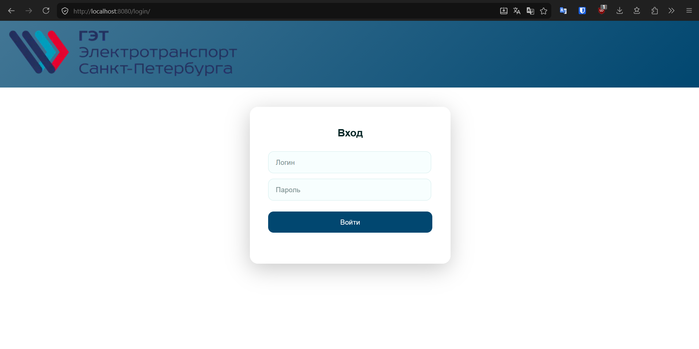
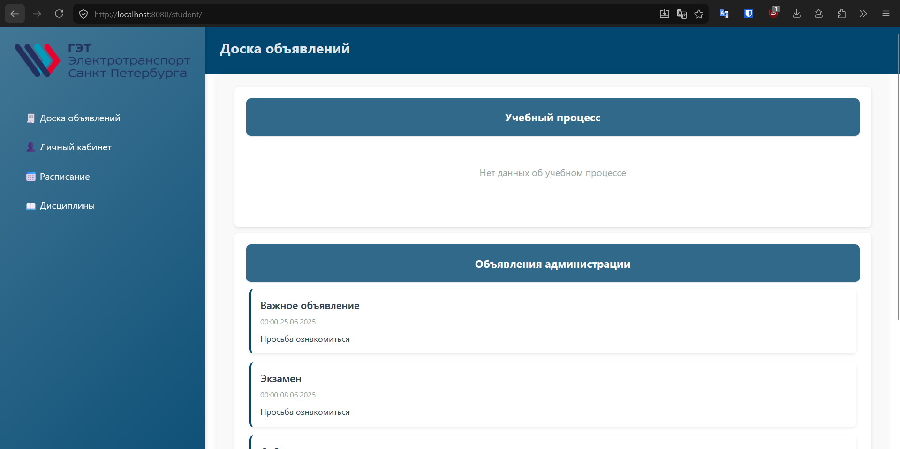
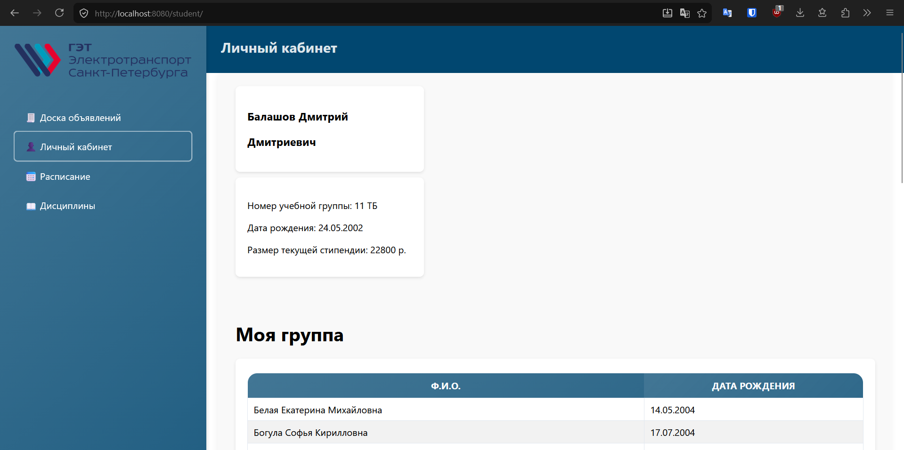
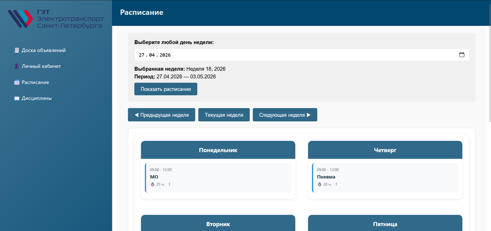
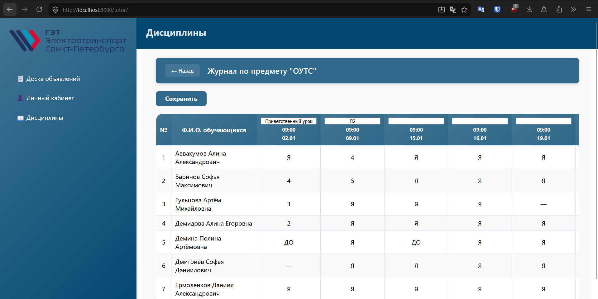

# 📚 Электронный журнал

Веб-приложение для ведения электронного журнала. Ученикам приложение позволяет просматривать оценки и следить за своей успеваемостью, а также отслеживать уроки и оценки по ним. Учителя могут редактировать оценки и посещаемость учеников по группам для преподаваемых дисциплин. Кураторы имеют возможность редактировать любые посещения и оценки (не привязаны к определённым группам).

## 🎬 Демонстрация

Далее приведены некоторые страницы приложения

### Вход



### Дашборд



### Личный кабинет



### Расписание



### Журнал успеваемости



## Стек

- **Backend**: Go (1.21+), GORM, SQLite
- **Frontend**: HTMX, HTML/template
- **Auth**: bcrypt + сессии

## Особенности

- 👨‍🏫 Три роли: учитель, студент, куратор
- 📝 Журнал оценок с посещаемостью
- 📅 Расписание занятий
- 🔄 Динамические обновления через HTMX
- 🔐 Безопасное хеширование паролей

## Запуск

```bash
go mod download
go run main.go
# http://localhost:8080